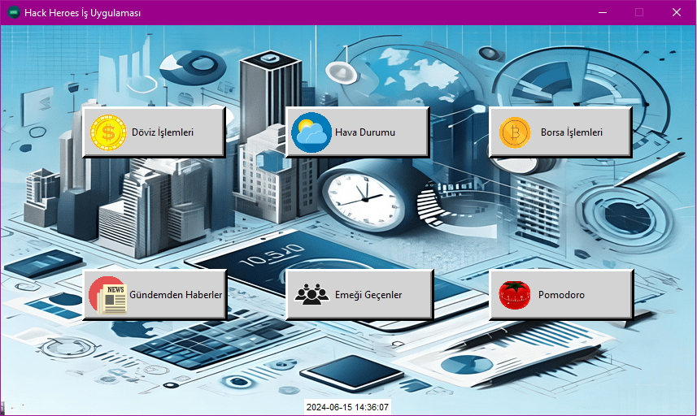
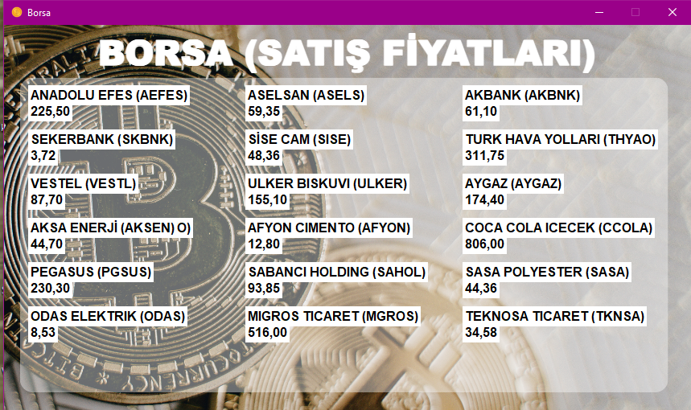
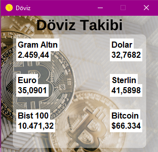
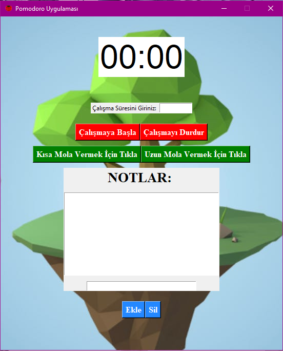
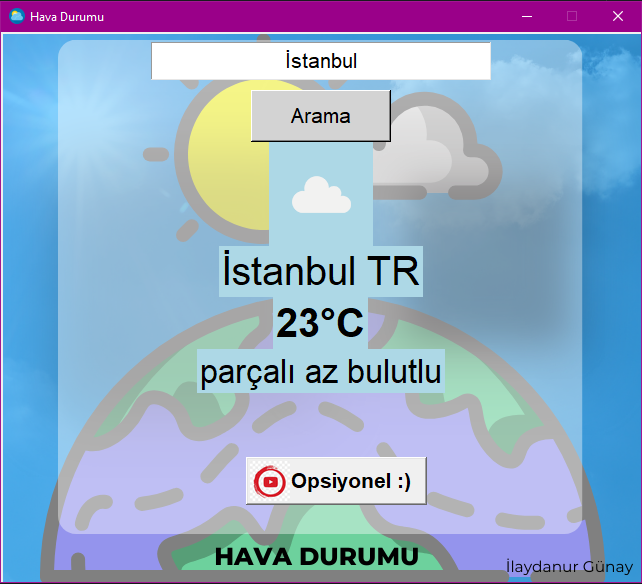

# **Ana Sayfa**

# **Borsa Takip**

# **Döviz Takip**

# **Pomodoro**

# **Hava Durumu**

# **Kurulum**

**İndirmek İçin:** git clone https://github.com/KullaniciAdi/RepoAdi.git  
**Gereksinimleri yükleyin:** pip install -r requirements.txt  
**Uygulamayı başlatın:** python is_uygulamasi.py  
